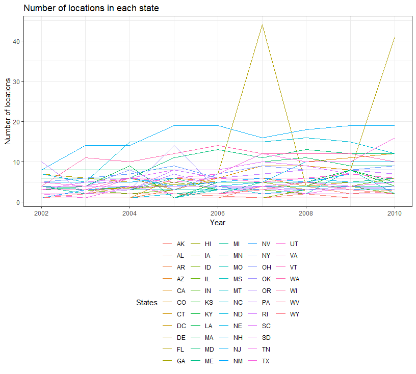
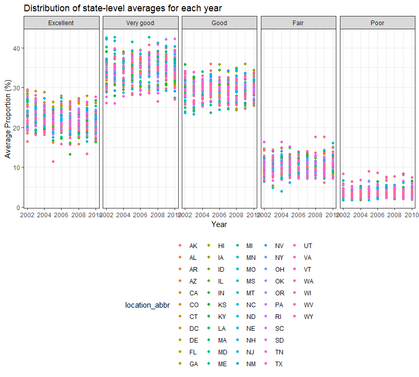
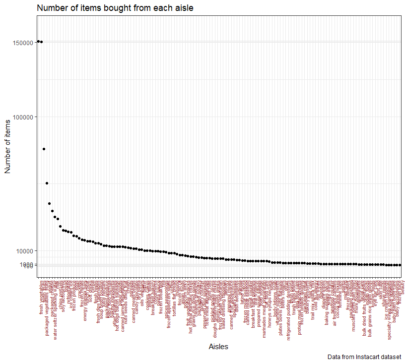

P8105 HW3
================
Abhishek Ajay (aa4266)
October 14, 2018

Problem 1
=========

Data import and cleaning

``` r
brfss_data_tidy = 
  p8105.datasets::brfss_smart2010 %>% 
  janitor::clean_names() %>% 
  rename(resp_id = respid, location_abbr = locationabbr, location_desc = locationdesc) %>% #further manual renaming to appropriate variable names
  filter(topic == "Overall Health") %>% 
  select(year, location_abbr, location_desc, response, data_value)

brfss_data_tidy$response = 
  brfss_data_tidy$response %>%  
  factor(levels = c("Excellent", "Very good", "Good", "Fair", "Poor"))

brfss_data_tidy
```

    ## # A tibble: 10,625 x 5
    ##     year location_abbr location_desc         response  data_value
    ##    <int> <chr>         <chr>                 <fct>          <dbl>
    ##  1  2010 AL            AL - Jefferson County Excellent       18.9
    ##  2  2010 AL            AL - Jefferson County Very good       30  
    ##  3  2010 AL            AL - Jefferson County Good            33.1
    ##  4  2010 AL            AL - Jefferson County Fair            12.5
    ##  5  2010 AL            AL - Jefferson County Poor             5.5
    ##  6  2010 AL            AL - Mobile County    Excellent       15.6
    ##  7  2010 AL            AL - Mobile County    Very good       31.3
    ##  8  2010 AL            AL - Mobile County    Good            31.2
    ##  9  2010 AL            AL - Mobile County    Fair            15.5
    ## 10  2010 AL            AL - Mobile County    Poor             6.4
    ## # ... with 10,615 more rows

Here we cleaned the data by focussing only on the "Overall Health" topic. Under this topic the response are exhaustively "Excellent", "Very good", "Good", "Fair" and "Poor".

We recoded the reponse column into a factor data type and set the levels from the "Excellent" to "Poor".

Now we do some *exploratory analysis* of the data in the following:

Q1. In 2002, which states were observed at 7 locations?

``` r
brfss_data_tidy %>% 
  ungroup() %>% 
  filter(year == 2002) %>% 
  distinct(location_abbr, location_desc) %>% 
  group_by(location_abbr) %>% 
  count() %>% 
  filter(n == 7) %>% 
  select(location_abbr) %>% 
  knitr::kable()
```

| location\_abbr |
|:---------------|
| CT             |
| FL             |
| NC             |

In 2002, the states: CT, FL and NC were observed at 7 locations.

Q2. Make a “spaghetti plot” that shows the number of locations in each state from 2002 to 2010.

``` r
#Restructuring the data for the plot required and Spaghetting plot using ggplot
brfss_data_tidy %>% 
  ungroup() %>% 
  group_by(year, location_abbr) %>% 
  distinct(location_abbr, location_desc) %>% 
  summarise(location_count = n()) %>% 
  ggplot(aes(x = year, y = location_count, color = location_abbr)) +
    geom_line() +
    labs(
      title = "Number of locations in each state",
      x = "Year",
      y = "Number of locations",
      color = 'States'
    ) 
```



In the above we show a spaghetting plot for number of location sin each state from 2002 to 2010.

Q3. Make a table showing, for the years 2002, 2006, and 2010, the mean and standard deviation of the proportion of “Excellent” responses across locations in NY State.

``` r
brfss_data_tidy %>% 
  ungroup() %>% 
  filter(year == 2002 | year == 2006 | year == 2010, location_abbr == "NY", response == "Excellent") %>% 
  group_by(year) %>%
  summarise(mean_excellent = mean(data_value, na.rm = TRUE),
            sd_excellent = sd(data_value, na.rm = TRUE)
  ) %>% 
  knitr::kable(digits = 2)
```

|  year|  mean\_excellent|  sd\_excellent|
|-----:|----------------:|--------------:|
|  2002|            24.04|           4.49|
|  2006|            22.53|           4.00|
|  2010|            22.70|           3.57|

The above table displays the mean and standard deviation of the *excellent* responses from different locations in NY State for years 2002, 2006 and 2010

Q4. For each year and state, compute the average proportion in each response category (taking the average across locations in a state). Make a five-panel plot that shows, for each response category separately, the distribution of these state-level averages over time.

``` r
brfss_data_tidy %>% 
  ungroup() %>% 
  group_by(year, location_abbr, response) %>% 
  summarise(mean_response = mean(data_value)) %>% 
  ggplot(aes(x = year, y = mean_response, color = location_abbr)) +
  geom_point() +
  facet_grid(~ response) +
  labs(
      title = "Distribution of state-level averages for each year",
      x = "Year",
      y = "Average Proportion (%)"
    ) 
```

    ## Warning: Removed 21 rows containing missing values (geom_point).



In the above five-panel plot, we show the distribution of the proportion of the five responses per year per state.

Problem 2
=========

Here we work on the Instacart data from the p8105.datasets package.

Data Import

``` r
instacart_data =
  p8105.datasets::instacart
#summary(instacart_data) %>% 
 # View()

n_order_per_hour_of_day = 
  instacart_data %>% 
  group_by(order_hour_of_day) %>%
  distinct(order_id) %>% 
  summarise(n_order_per_hour = n()) %>% 
  arrange(desc(n_order_per_hour))
```

### Data Description

The instacart dataset has the dimensions (rows, columns): *1384617, 15*. It basically describes the various characteristics associated with a specific order, pin pointed using the order\_id. There are *131209* number of unique orders. There are *131209* unique users. Since both the numbers are same, we infer that the each unique user had only one unique order (characterised by an order\_id) by them.

Some other Key variables apart from the obvious "order\_id" and "user\_id" as discussed above are the

-   *21* unique departments, with each department given a unique "department\_id",

-   *134* aisles with unique "aisle\_id",

-   *39123* unique products with each "product\_name" with a unique "product\_id".

We notice that "eval\_set" for all orders in **train** and hence consider that column to be redundant since it can clearly be mentioned in single line in the data description.

Largest number of orders are done at the *14* with *11103* orders.

Least number of orders are taken at the *4* with *218* orders only.

Further exploratory analysis of the *"instacart\_data"*.

Q1. How many aisles are there, and which aisles are the most items ordered from?

``` r
instacart_data %>% 
  group_by(aisle_id, aisle) %>% 
  select(order_id, aisle_id) %>% 
  summarise(n_orders_per_aisle = n()) %>% 
  arrange(desc(n_orders_per_aisle)) %>% 
  head(1) %>% 
  knitr::kable()
```

    ## Adding missing grouping variables: `aisle`

|    aisle\_id| aisle               |                                                                                                                                                                                                               n\_orders\_per\_aisle|
|------------:|:--------------------|-----------------------------------------------------------------------------------------------------------------------------------------------------------------------------------------------------------------------------------:|
|           83| fresh vegetables    |                                                                                                                                                                                                                              150609|
|  There are 1| 34 aisles. The tabl |  e was grouped with aisle and aisle\_id just to make sure that the aisle name is mentioned in the table, elsewise, each aisle has a unique aisle\_id and hence just taking either one of them for grouping won't change the answer.|

Since each order\_id is unique to a single order, summarising along the group gives us the number of orders per aisle.

Q2. Make a plot that shows the number of items ordered in each aisle. Order aisles sensibly, and organize your plot so others can read it.

``` r
instacart_data %>% 
  group_by(aisle) %>% 
  summarise(n_items = n()) %>% 
  mutate(aisle = fct_reorder(aisle, desc(n_items))) %>% 
  ggplot(aes(x = aisle, y = n_items)) +
  geom_point() +
  scale_y_continuous(breaks = c(100, 1000, 10000, 100000, 150000),
                     limits = c(100, 160000), 
                     labels = c("100", "1000", "10000", "100000", "150000")
                     ) +
  theme(axis.text.x = element_text(color = "#993333", angle = 90, size = rel(0.8), hjust = 1)) +
  labs(
    title = "Number of items bought from each aisle",
    x = "Aisles",
    y = "Number of items", 
    caption = "Data from Instacart dataset"
  ) #From http://www.sthda.com/english/wiki/ggplot2-axis-ticks-a-guide-to-customize-tick-marks-and-label
```


